<div align="center">

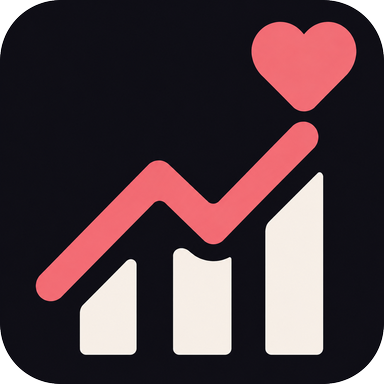

# Climax

**Session tracking for your Stash library.**

[](LICENSE)
[](#installation)
[](https://github.com/pineapplestorm/climax/releases)

[What it does](#what-it-does) · [Requirements](#requirements) · [Installation](#installation) · [Questions](#questions)

</div>

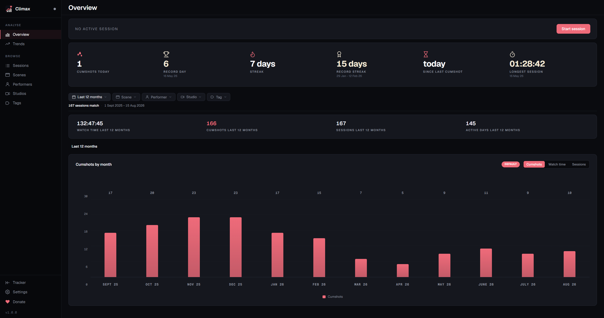

Climax is a full-featured expansion of [Stash](https://github.com/stashapp/stash)'s limited built-in stats tracking. It builds on the history Stash already keeps, adding sessions, watch time, trends and records, and syncing back as you go.

If you have ever wondered when you actually watch, how often, what you keep going back to, or how long a session lasted, a play count cannot answer you. It is a total. It has no idea that four of those plays happened on the same Sunday night, one after another, because nothing in Stash records a sitting.

Climax records the sitting. A small bridge plugin tells it which scene is playing, and it writes down when you started, what you watched, how long each scene ran, and every O against the scene and the moment it happened. It stays on your machine, in one SQLite file. Run it on your desktop, or headless in Docker so it never misses anything.

Requires a running [Stash](https://github.com/stashapp/stash) instance.

## What it does

### Sessions, not just play counts

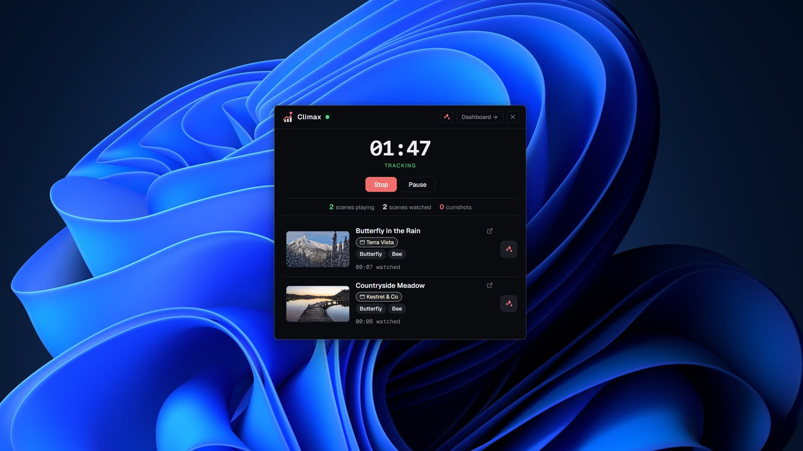

To track a session, press start in the Climax tracker, or hit **Ctrl+Shift+L** (Cmd+Shift+L on a Mac) from anywhere on your system, and Climax takes it from there. It sits in the background noting what you play, how long you stay with each scene, and any O's, whether you log those in the tracker or press the O button in Stash. Pause if you step away, stop when you are done, and a short wrap-up catches anything you missed.

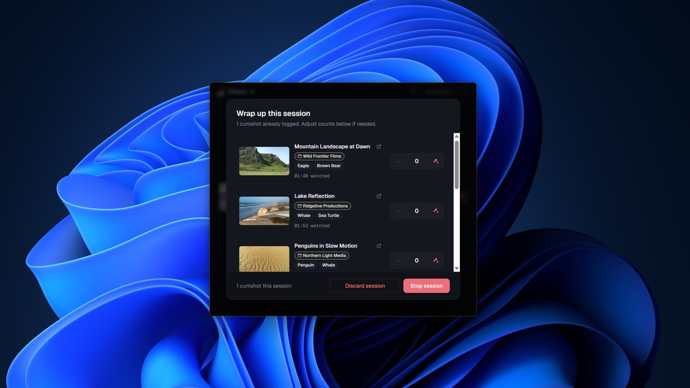

Watching on a TV or a phone instead? Those plays are picked up from Stash and folded into the session. Walk away for a while and Climax notices, then asks whether to keep the idle time or trim it off.

### Your history, browsable

Every session you have tracked is listed on the Sessions page, sorted however you like: by when it started, how long it ran, how many scenes were in it, or how many O's came out of it.

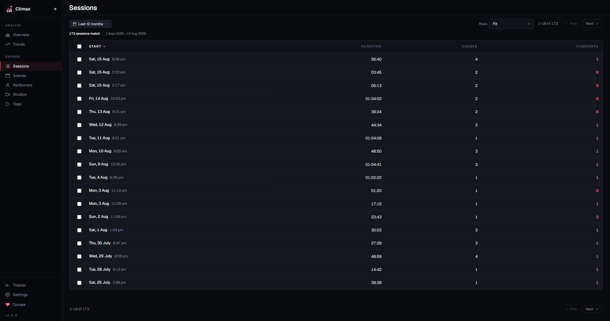

Open a session and you get a timeline of what happened.

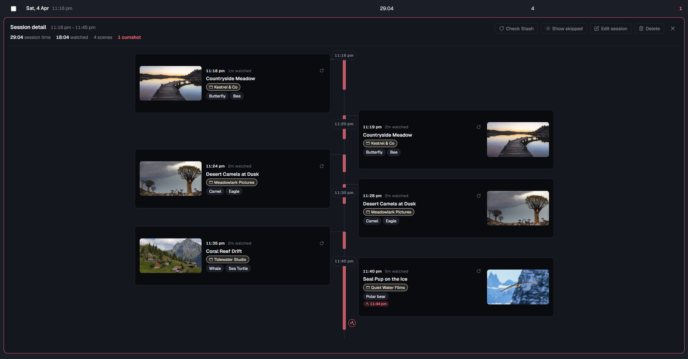

None of it is fixed. Correct the start or end, add an O you forgot, leave yourself a note, or pull in a scene that was open at the time but never counted. Two sittings that should have been one can be merged.

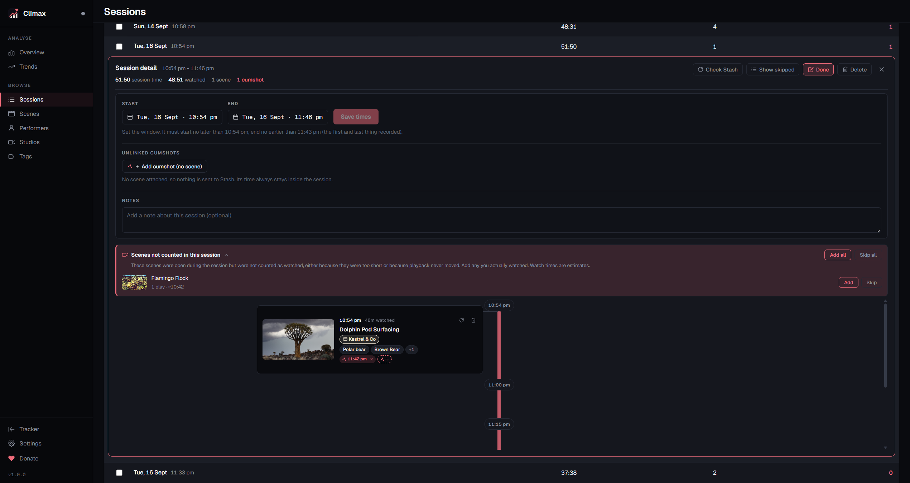

Pick a single day and you get its shape instead: each session as a bar across the hours, so a quiet afternoon and a long evening are obvious at a glance.

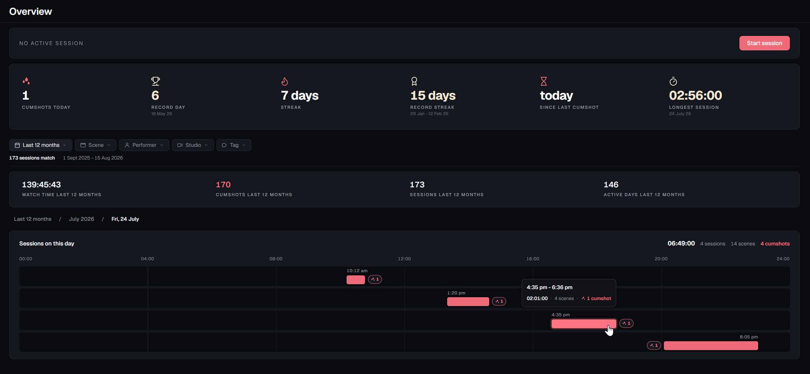

Scenes, performers, studios and tags each get a page ranked by what you have watched rather than by what your library holds, sorted by watch time, O count or plays across whatever period you choose.

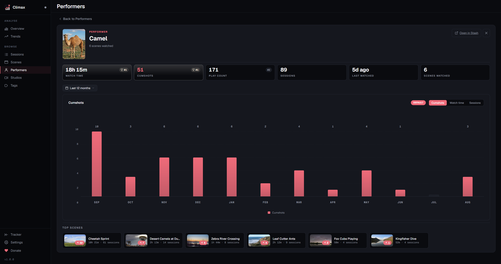

Click into any of them and you get that one on its own: how it ranks against the rest of your library, a chart of the last twelve months, and the scenes you spent the most time on.

### Trends and reports

Zoom out and habits show up that no single session would tell you about. Set any period you like, from a week to everything you have ever tracked, and the whole page follows it: totals with their movement against the period before, a chart you can switch between watch time, O's, sessions or active days, the days of the week you reach for, the hours you tend to start, and leaderboards for the performers, studios and tags you spend the most on. Your current streak sits next to your best one, and the consistency heatmap always shows a full year whatever period you pick.

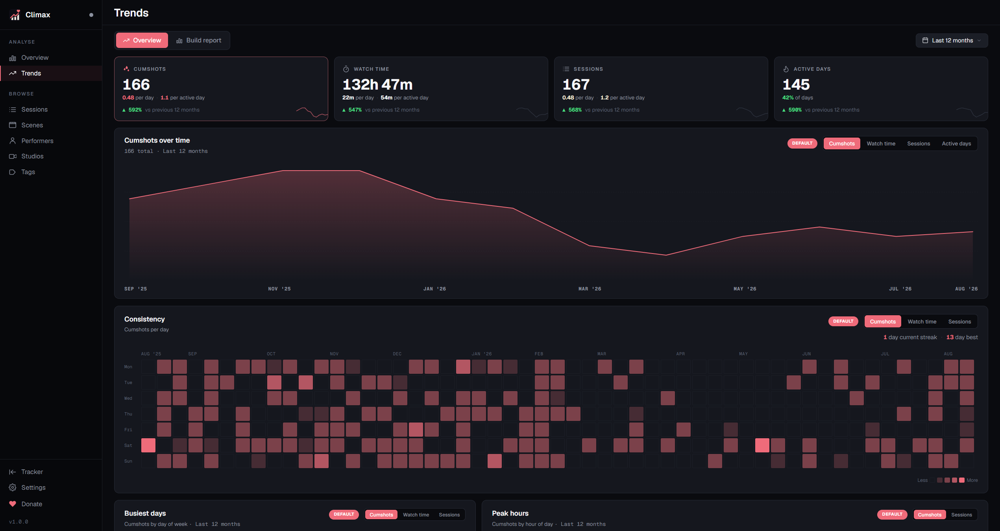

If none of that is the cut you were after, build your own. Pick a metric, group it by scene, performer, studio, tag or time of day, narrow it to a single one of them, and set whatever range you like. Export the result to CSV if you want it somewhere else.

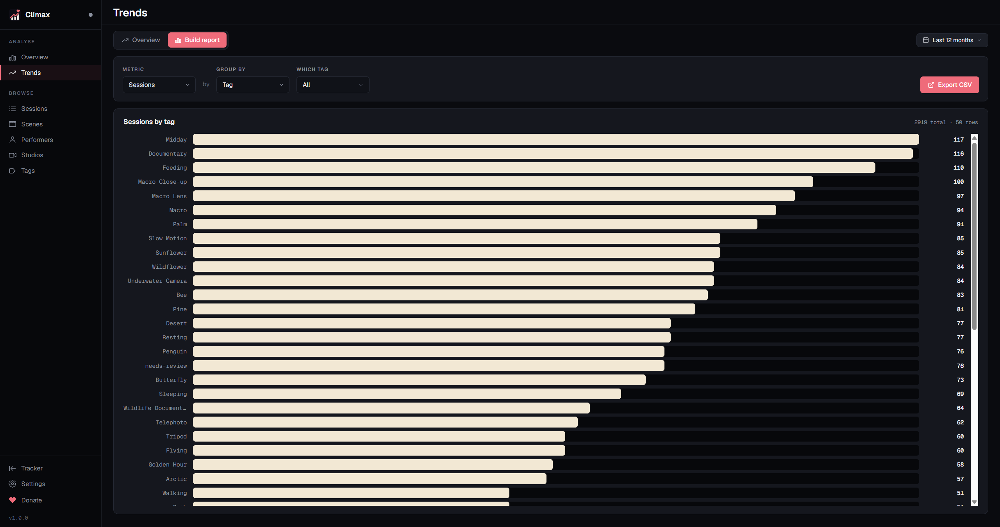

### Nothing has to be logged by hand

Forgetting to press start is how every tracker fails, so this one is covered from three directions.

The first is that you never have to go looking for Climax. The bridge puts an indicator in your Stash navbar that turns green the moment a session is running, so whether you are tracking is answered at a glance from any page. Its menu starts, pauses and stops sessions, and opens the dashboard, without leaving the tab you are in.

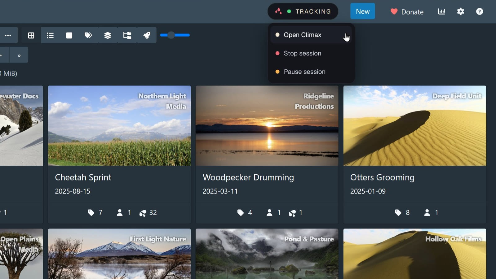

**Ctrl+Shift+L** does the same from anywhere on your desktop, whether Stash is open or not: it brings up the tracker and starts a session if none is running. Switchable in Settings if you would rather it were not there.

Second, it can speak up when you are plainly watching something with no session running. It names the scene, says how long you have been at it, and offers to start a session backdated to when playback began, so nothing before the prompt is lost.

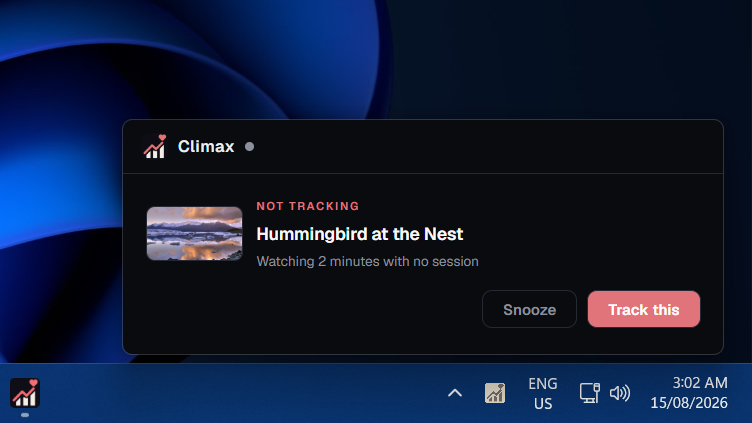

That one stays off until you switch it on.

Third, and most usefully, it rebuilds sittings you never tracked at all. Stash has been timestamping plays since long before you installed this, and Climax reads that history back, clusters it into likely sessions, and offers them one at a time.

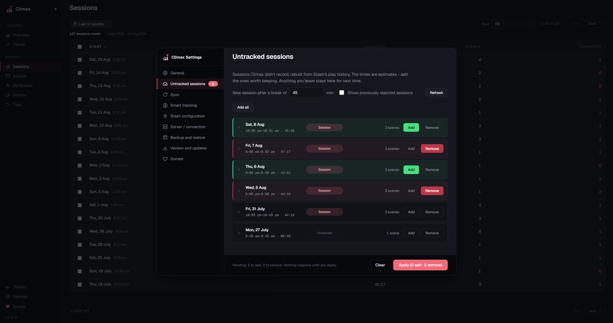

Nothing is created behind your back. Each candidate shows its date, its span, how many scenes it covers and how confident the guess is, and you add or dismiss it yourself. They are estimates, and they stay labelled as estimates on the session itself. Stash records when a play registered, never how long you watched, so watch times are inferred, and capped by what Stash holds. Setup can do the same across your whole back catalogue in one pass, which means years of history instead of starting from zero on day one.

Then there is the opposite case. Switch on organising mode while you are tagging and tidying, and Stash stops logging plays until you switch it off, so an afternoon of scrubbing through scenes never turns up as watching.

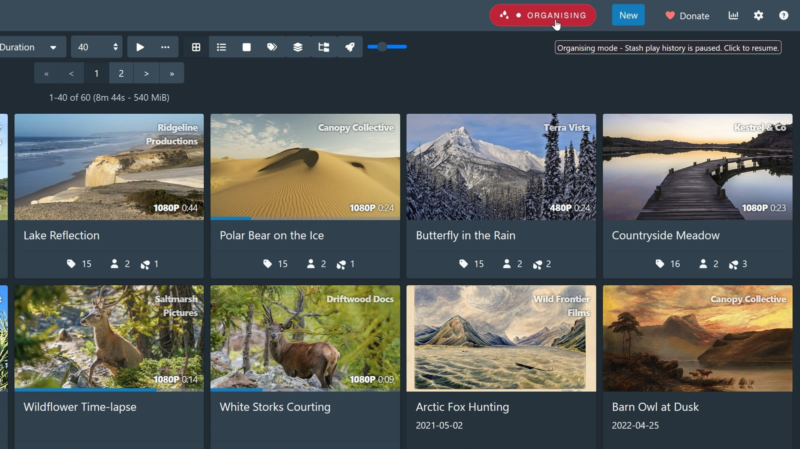

### Two-way O sync, and nothing else touched

Your O counter is the only thing Climax writes to Stash.

- **O's sync both ways.** Log one in Climax and Stash gets it. Remove one and it goes from both. Press the O button in Stash and the bridge catches it, so the two never drift apart.
- **Plays and watch time are read only.** Climax mirrors them for its own pages and never writes them back.
- **Deleting a session takes its footprint with it.** The O's, plays and watch time that session contributed come back out of Stash too, instead of being left behind.

Everything else stays in one SQLite file on your machine. No account, no sign-in, no cloud, no analytics, no telemetry. The only request that leaves your network is a version check against GitHub's releases API, and you can turn it off.

### Out of the way

The desktop app lives in your tray, so closing the window puts it away rather than stopping it. Start and stop a session, or open either window, without going near the dashboard.

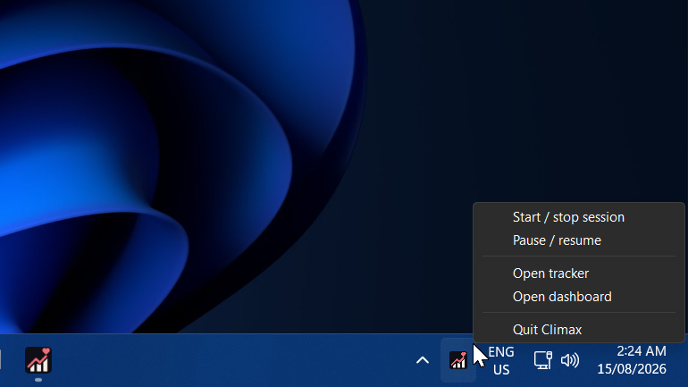

### Running it as a server

Climax also runs headless: the same application with no windows, keeping the database and doing the tracking on a machine that stays on.

That suits you if tracking should not depend on one particular computer being awake, if you watch across a few devices and want the lot in one history, or if you already have a NAS or home server doing jobs like this. It runs in Docker, so anything that runs Docker will do.

With no windows, you reach it in a browser: the full dashboard, from any device on your network, phone included. Point the bridge at the server's address and everything you watch lands there, whichever machine you happened to be on.

The desktop app can then run alongside it as a client rather than on its own, connecting to the server instead of keeping its own copy. You keep the tray, the keyboard shortcut, idle detection and the tracker window on the machine you sit at, while the history lives on the server.

Compose file and deployment notes are in [`deploy/`](deploy/README.md).

## Requirements

[Stash](https://github.com/stashapp/stash), running and reachable. Climax reads your library, scene metadata and play history from it, and syncs O's back. Tested against Stash 0.31.

Windows and macOS both ship as normal installers; the Mac build is Apple Silicon only. For the server, anything that runs Docker, including a NAS.

## Installation

### Install the app

Download the latest installer from [Releases](https://github.com/pineapplestorm/climax/releases) and run it. Neither build is code signed, so Windows shows SmartScreen (choose **More info**, then **Run anyway**) and macOS needs a right-click then **Open** the first time.

### Add the bridge plugin

On first launch Climax asks for your Stash address and offers to install the bridge for you. That is one click. It adds the plugin source to Stash and installs [**Climax Bridge**](https://github.com/pineapplestorm/pineapplestorm-stash-plugins/tree/main/plugins/climax-bridge) from it, so the bridge appears in your normal plugin updates from then on.

To do it by hand instead, in Stash go to **Settings → Plugins → Available Plugins → Add Source** and paste:

```
https://pineapplestorm.github.io/pineapplestorm-stash-plugins/main/index.yml
```

Find **Climax Bridge**, click Install, then reload your Stash tab.

### Import existing Stash play history

Setup offers to import what Stash already knows and to estimate past sessions from it. Both are optional, and both can be run later from Settings.

## Questions

**Is any of this sent anywhere?** - No. One local database file, and one version check against GitHub that you can switch off.

**Will it change my library?** - Only the O counter, and only when you act. Plays and watch time are read only.

**What if I forget to start a session?** - Two safety nets. Climax can prompt you when it spots untracked watching, and it can rebuild missed sittings afterwards from the history Stash kept. Neither writes anything you have not approved.

**Does it track what I watch on my phone or TV?** - Yes. The bridge only sees browser playback, so anything else is picked up from Stash's own activity. That path is coarser, since Stash reports roughly every half minute.

**Does it keep tracking when I close the window?** - Closing hides it to the tray and tracking carries on. Quitting stops it. Run it as a server for tracking that does not depend on any window being open.

**Can I use it without the bridge?** - Treat it as required. Strictly speaking some of it still works, since sessions and O's can be built from Stash's play history alone, but you lose live watch time, the navbar indicator and most of the reason to run Climax in the first place. Installing it is one click during setup.

**Is my data locked in?** - No. It is a plain SQLite file you can back up from Settings, copy, or open in any SQLite tool. Reports export to CSV.

## License

AGPL-3.0. See [LICENSE](LICENSE) for the full terms.
